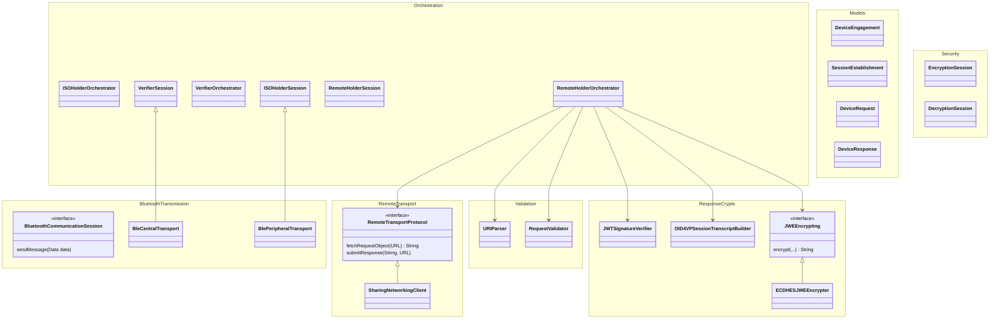

# Mobile | Credential sharing SDK | iOS

This SDK provides a framework for **Holder** (credential sharing) and **Verifier** (credential requesting) roles. Consuming applications adopt the role relevant to their use case (e.g., an identity wallet adopts the Holder role; a relying party app adopts the Verifier role).

The current implementation includes a demo app and supports two Holder presentation flows:

- **ISO (in-person):** ISO 18013-5 proximity presentation and verification over Bluetooth, initiated by a QR code / device engagement.
- **Remote (OID4VP):** OpenID for Verifiable Presentations, initiated by an `mdoc-openid4vp://` deeplink. The wallet fetches a signed request from the verifier and returns an encrypted response over HTTPS — no proximity or Bluetooth.

For internal team members: our ways of working can be found on Confluence.

## Overview

**ISO 18013-5 (in-person):**

- **Device Engagement:** Generates and scans QR codes; broadcasts and connects over BLE/NFC.
- **Session Management:** Establishes secure channels (mdoc session encryption).
- **Message Passing:** Creates, transmits, and parses `DeviceRequests` and `DeviceResponses`.

**OID4VP (Remote):**

- **Request handling:** Parses the `mdoc-openid4vp://` deeplink, fetches the signed Authorization Request Object from the verifier's `request_uri`, verifies its JWS signature, and validates it.
- **Query processing:** Maps the verifier's DCQL query to an ISO `ItemsRequest`, then retrieves and selectively discloses the matching credential attributes.
- **Response building:** Binds the response to the request via an OID4VP `SessionTranscript`, signs the `DeviceAuth`, assembles the `DeviceResponse`, JWE-encrypts it (ECDH-ES + A256GCM) for the verifier, and PUTs it to the `response_uri`.

### Credential Provisioning Flow

The user does not pre-select a credential prior to session initialisation. Verifier attribute requirements are determined after a secure connection is established. Data exchange proceeds as follows:

1. The SDK receives the `DeviceRequest` and queries the Consumer via the `CredentialProvider`.
2. The SDK (or Consumer) presents the consent UI based on the requested attributes.
3. Following consent, the Consumer provides the requested data and cryptographic signatures.

---

This repository contains targets for: 

- Orchestration: Orchestrates the flow & holds the current session and state (ISO and Remote)
- CredentialSharingUI: represents the UI layer connecting to the Orchestrator
- PrerequisiteGate: ensures the device is capable of performing the transaction before cryptography & transport
- CryptoService: representing data models in CBOR format, session encryption/decryption, and the OID4VP JWE response encrypter
- ValidationService: parses the `mdoc-openid4vp://` deeplink and validates the signed request object (Remote flow)
- BluetoothTransport: sharing data over Bluetooth (ISO flow)
- NetworkTransport: fetches the request object and PUTs the encrypted response over HTTPS (Remote flow)
- CameraService: Holds the camera logic for Verifier scanning



## Requirements

- iOS 16.7
- Xcode 26
- Swift 6

## Setup and installation

1. **Clone the repository**:
   ```bash
   git clone https://github.com/govuk-one-login/mobile-credential-sharing-ios.git
   cd mobile-credential-sharing-ios
   ```

2. **Open in Xcode**:
   ```bash
   open mobile-credential-sharing-ios.xcworkspace
   ```

3. **Configure Team and Bundle Identifier**:
   - Select the project in Xcode
   - Update Team and Bundle Identifier in project settings
   - Ensure proper code signing is configured

4. **Build and Run**:
   - Select your target device
   - Build and run the application

## Usage

### Integration Guide: Holder Role

The **Consumer** adopting the Holder role provisions and stores credentials securely. It acts as the secure vault, supplying both issuer-signed data and device signatures when a Verifier initiates a request.

To maintain cryptographic boundaries, the Consumer provides the decrypted raw CBOR credential data; the SDK handles CBOR parsing and filtering. To prove device possession and bind the credential to the current BLE/NFC session, the SDK constructs a `DeviceAuthentication` payload, which the Consumer then signs using the credential's Secure Enclave private key. Finally, the SDK handles all mdoc session encryption for the transport tunnel.

#### 1. Implement the Credential Provider Protocol

The Consumer implements the `CredentialProvider` to allow the SDK to access credentials. The SDK invokes these methods after establishing a secure connection.

```swift
import CredentialSharingUI

class MyCredentialProvider: CredentialProvider {
    
    /// 1. Query Credentials: The SDK invokes this method when the Verifier requests specific document types.
    /// The Consumer returns credentials from secure storage matching the requested types.
    /// Initially this will always return an array of exactly one element: the decrypted raw CBOR data 
    /// for the user's mDL credential.
    func getCredentials(
        for request: CredentialRequest
    ) async throws -> [Credential] {
        // The Consumer retrieves and decrypts the credential payload from secure storage.
        // Returns the raw CBOR data for the requested document type(s).
        let rawCredential = try await secureStorage.fetchCredential(
            matching: request.documentTypes
        )
        
        return [Credential(
            id: rawCredential.id,
            rawCredential: rawCredential.cborData
        )]
    }
    
    /// 2. Device Authentication (Remote Signing): The SDK constructs a `DeviceAuthentication` CBOR payload.
    /// This payload proves device possession and includes session transcripts to prevent replay attacks.
    /// The Consumer signs this payload using the credential's static device private key (Secure Enclave).
    func sign(
        payload: Data, 
        documentID: String
    ) async throws -> Data {
        // 1. The Consumer signs the `payload` using the Secure Enclave.
        // 2. The Consumer returns the signature to the SDK for transport encryption.
        let privateKey = try await secureStorage.getSecureEnclaveKey(for: documentID)
        let signature = try privateKey.signature(for: payload)
        return signature.rawRepresentation
    }
}
```

**Data Models:**

```swift
struct CredentialRequest {
    let documentTypes: [String]
}

struct Credential {
    let id: String
    let rawCredential: Data  // Raw CBOR-encoded credential data
}
```

#### 2. Initialise the Holder Module

The Consumer initialises the sharing module by injecting the provider.

```swift
let credentialProvider = MyCredentialProvider()
let presenter = CredentialPresenter(
    credentialProvider: credentialProvider,
    logger: logger,
    completion: {}
)
```

#### 3. Start a Sharing Session

The Consumer initiates the engagement QR code display. The SDK awaits the Verifier's request, queries the `CredentialProvider`, and prompts for consent.

```swift
// The SDK displays the Device Engagement UI (QR code) and listens for Verifiers.
let journeyVC = presenter.viewControllerForISOSharingJourney()
self.present(journeyVC)
```

---

### Integration Guide: Holder Role — Remote (OID4VP)

The Remote flow lets a Holder respond to an **OpenID for Verifiable Presentations** request delivered as an `mdoc-openid4vp://` deeplink (for example, tapped in a browser on the same device). Unlike the ISO flow there is no proximity engagement or Bluetooth: the wallet fetches a signed request from the verifier and returns an **encrypted response over HTTPS**.

The Consumer integration is almost identical to the ISO flow — **the same `CredentialProvider` is reused unchanged**. Retrieval and device signing work exactly as before (the SDK builds the `DeviceAuthentication` payload; the Consumer signs it with the Secure Enclave key). Only the entry point differs.

#### 1. Register the URL scheme

Add the `mdoc-openid4vp` scheme to your app's `Info.plist` so the OS launches your app for these deeplinks:

```xml
<key>CFBundleURLTypes</key>
<array>
    <dict>
        <key>CFBundleURLSchemes</key>
        <array>
            <string>mdoc-openid4vp</string>
        </array>
    </dict>
</array>
```

#### 2. Start a Remote sharing session from the deeplink

When your app receives an `mdoc-openid4vp://` URL (e.g. in `SceneDelegate`'s `openURLContexts`), hand it to the presenter:

```swift
let credentialProvider = MyCredentialProvider()  // the same provider as the ISO flow
let presenter = CredentialPresenter(
    credentialProvider: credentialProvider,
    logger: logger,
    completion: {}
)

// The SDK fetches & validates the request, shows the consent screen, then builds,
// encrypts and submits the response. It dismisses the modal on success.
let journeyVC = presenter.viewControllerForRemoteSharingJourney(deeplink: url)
self.present(journeyVC, animated: true)
```

#### Internal flow

After the deeplink is received, the SDK drives the whole exchange; the Consumer is only involved via the `CredentialProvider` (credential lookup and device signing):

1. **Parse** the `mdoc-openid4vp://` deeplink to extract `client_id` and `request_uri`.
2. **Fetch** the signed Authorization Request Object from `request_uri`.
3. **Verify** its JWS signature against the leaf certificate in the `x5c` header.
4. **Validate** the request object (audience, response type/mode, `client_id` ↔ certificate SAN, nonce, verifier encryption key, DCQL query).
5. **Map** the DCQL query to an ISO `ItemsRequest`.
6. **Retrieve** the matching credential from the `CredentialProvider` and **filter** it to the requested attributes (selective disclosure).
7. **Consent:** display the requested attributes and the verifier's identity for the user to approve.
8. **SessionTranscript:** build the OID4VP handover (hashing `client_id`, `response_uri`, and a fresh `mdocGeneratedNonce`) to bind the response to this request.
9. **DeviceAuth:** construct the `DeviceAuthentication` payload and have the `CredentialProvider` sign it (COSE_Sign1).
10. **Assemble** the `DeviceResponse` and CBOR-encode it, wrapped in the OID4VP `vp_token` response object.
11. **Encrypt** the response as a compact JWE (ECDH-ES key agreement + A256GCM) using the verifier's public key.
12. **Submit** the JWE to the verifier's `response_uri` via HTTPS PUT, then dismiss on success.

---

### Integration Guide: Verifier Role

#### [Sample implementations can be found here](docs/sample-implementations.md)

The **Consumer** adopting the Verifier role requests attributes and consumes the verified response. It acts as the trust anchor, supplying the SDK with the Root Certificates of trusted issuers.

To maintain cryptographic boundaries, the SDK handles the complete transaction lifecycle: it manages the camera scanner, establishes the secure BLE tunnel, decrypts the `DeviceResponse`, and cryptographically validates the Issuer's signature and data integrity. The Consumer defines the request and receives the validated data.

#### 1. Initialise the Verifier Module

The Consumer initialises the Verifier module, injecting the Root Certificates used to validate the Issuer's signature on the credential. The SDK utilises an internal `PrerequisiteGate` to resolve transport availability at runtime.

```swift
import CredentialSharingUI

// Provide the Root CAs for the issuing authorities you trust
let trustedRoots = [myGovernmentRootCA, myOtherTrustedCA]

let verifier = CredentialVerifier(
    trustedCertificates: trustedRoots
)
```

#### 2. Request Attributes

The Consumer defines the `CredentialRequest` up front. This specifies the document type, the required attributes and an intent to retain boolean value for each attribute.

```swift
let request = CredentialRequest(
    documentType: "org.iso.18013.5.1.mDL",
    requestedElements: ["family_name": true, "given_name": false, "age_over_18": false]
)
```

#### 3. Start Verification & Process Response

The SDK takes control of the flow: it launches the camera, scans the engagement QR code, establishes the BLE connection, transmits the request, and validates the response. The Consumer awaits the final, cryptographically verified data.

```swift
do {
    // The SDK handles the entire scanning, connection, and validation lifecycle
    let verifiedData = try await verifier.requestDocument(
        request, 
        presentingFrom: currentViewController
    )
    
    // The SDK has already validated the MSO signature and hash integrity. 
    // The Consumer can safely proceed with the verified flow.
    let ageOver18 = verifiedData.getValue(for: "age_over_18")
    let familyName = verifiedData.getValue(for: "family_name")
    
} catch {
    // Handle errors (e.g., user cancelled, invalid signature, connection dropped)
}
```

## Required Privacy Descriptions

Consuming apps must include the following keys in their `Info.plist` to use this SDK. iOS will prompt the user with your purpose string the first time the relevant feature is accessed, and the app will crash at runtime if the key is missing.

Which keys you need depends on the role your app adopts. These apply to the **ISO (in-person)** flows; the **Remote (OID4VP)** Holder flow uses HTTPS only and needs no Bluetooth or camera permission (it does require the `mdoc-openid4vp` URL scheme — see the Remote integration guide above).

| Key | Holder (ISO) | Verifier | Prompted |
|---|---|---|---|
| `NSBluetoothAlwaysUsageDescription` | Required | Required | First BLE connection |
| `NSCameraUsageDescription` | — | Required | First QR scan |

### Background Modes

Both roles require Bluetooth background execution. Add the following to your `Info.plist`:

```xml
<key>UIBackgroundModes</key>
<array>
    <string>bluetooth-central</string>
    <string>bluetooth-peripheral</string>
</array>
```

Or enable **Background Modes** in your target's Signing & Capabilities tab and check **Uses Bluetooth LE accessories** and **Acts as a Bluetooth LE accessory**.

### Example Entries

```xml
<key>NSBluetoothAlwaysUsageDescription</key>
<string>Bluetooth lets you securely share only the details a verifier requests, like your name or proof of age.</string>

<key>NSCameraUsageDescription</key>
<string>The camera scans a QR code to start a secure session with a nearby credential holder.</string>
```

### Writing Good Purpose Strings

Apple's [App Store Review Guideline 5.1.1](https://developer.apple.com/app-store/review/guidelines/#data-collection-and-storage) requires that purpose strings clearly explain why your app needs access and how the data will be used. Apple's [Write clear purpose strings](https://developer.apple.com/videos/play/tech-talks/110152/) Tech Talk recommends:

- **Be specific.** Explain what the app will do with the resource, not just that it needs it. Avoid vague phrases like "for a better experience".
- **Include a concrete example.** Describe the user-facing feature the permission enables.
- **Keep it concise.** One or two sentences is enough. Don't use the purpose string as marketing copy.
- **Localise.** If your app supports multiple locales, provide translations via `InfoPlist.strings`.

Replace the example strings above with descriptions specific to your app's context.
